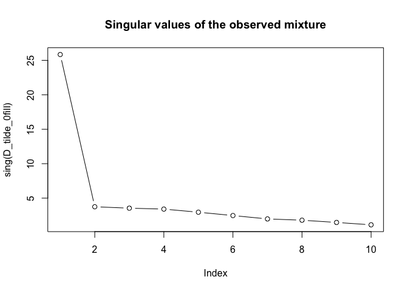
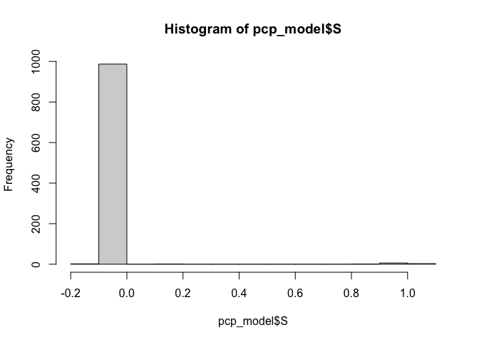

<!-- README.md is generated from README.Rmd. Please edit that file -->

# pcpr

<!-- badges: start -->

<!-- badges: end -->

The R package `pcpr` implements Principal Component Pursuit (PCP), a
robust dimensionality reduction technique, for pattern recognition
tailored to environmental health data. The statistical methodology and
computational details are provided in [Gibson et
al. (2022)](https://doi.org/10.1289/EHP10479).

## Installation

You can install the development version of pcpr from GitHub with:

``` r
# install.packages("pak")
pak::pak("Columbia-PRIME/pcpr")
```

## Modeling overview

PCP algorithms model an observed exposure matrix $D$ as the sum of three
underlying ground-truth matrices:

$$\underset{\text{mixture}}{D_{n \times p}} = \underset{\text{low-rank}}{L_0} + \underset{\text{sparse}}{S_0} + \underset{\text{noise}}{Z_0}$$

a low-rank matrix $L_0$ encoding consistent patterns of exposure, a
sparse matrix $S_0$ isolating unique or outlying exposure events (that
cannot be explained by the consistent exposure patterns), and dense
noise $Z_0$. All of these matrices are of dimension $n \times p$, where
$n$ is the number of observations (e.g. study participants or
measurement dates) and $p$ is the number of exposures (e.g. chemical
and/or non-chemical stressors). Beyond this mixtures model, the main
assumption made by PCP is that $Z_0 \sim \mathcal{N}(\mu, \sigma^2)$
consists of i.i.d. Gaussian noise corrupting each entry of the overall
exposure matrix $D$.

The models in `pcpr` seek to decompose an observed data matrix `D` into
estimated low-rank and sparse components `L` and `S` for use in
downstream environmental health analyses. The functions in `pcpr` are
outfitted with three environmental health (EH)-specific extensions
making `pcpr` particularly powerful for EH research:

1.  Missing value functionality
2.  Leveraging potential limit of detection (LOD) information
3.  Non-negativity constraint on the estimated `L` matrix

## Usage

`pcpr` supplies all of the functions needed to incorporate PCP into an
environmental health analyses. Let’s work through a short simulated
example first.

The `sim_data()` function lets users generate simple mixtures models for
quick experimentation. Let’s use it to simulate a noisy environmental
mixture comprised of 100 observations of 10 chemicals, with three
underlying chemical exposure patterns (or a rank $r = 3$), extreme
outlying exposure events along the diagonal of the matrix, and dense
Gaussian noise corrupting all the measurements in the matrix:

``` r
library(pcpr)

data <- sim_data(n = 100, p = 10, r = 3, sparse_nonzero_idxs = seq(1, 1000, 101), sigma = 0.05)
D <- data$D
L_0 <- data$L
S_0 <- data$S
Z_0 <- data$Z
```

We can see `L_0` has 3 underlying patterns using the `matrix_rank()`
function:

``` r
matrix_rank(L_0)
#> [1] 3
```

Because our mixtures data is often incomplete in practice, let’s
simulate a random 5% of the values as missing (`NA`) with the
`corrupt_mat_randomly()` function:

``` r
corrupted_data <- corrupt_mat_randomly(D, perc = 0.05)
D_tilde <- corrupted_data$D_tilde
D_tilde_0fill <- D_tilde
D_tilde_0fill[is.na(D_tilde)] <- 0
```

There are two PCP algorithms shipped with `pcpr`: the convex
`root_pcp()` \[[Zhang et
al. (2021)](https://proceedings.neurips.cc/paper/2021/hash/f65854da4622c1f1ad4ffeb361d7703c-Abstract.html)\]
and non-convex `rrmc()` \[[Cherapanamjeri et
al. (2017)](https://proceedings.mlr.press/v70/cherapanamjeri17a.html)\].
To figure out which model would be best for our data, let’s inspect the
singular values of our observed mixture using the `sing()` method:

``` r
plot(sing(D_tilde_0fill), type = "b", main = "Singular values of the observed mixture")
```



`rrmc()` is best suited for data characterized by slowly decaying
singular values, indicative of complex underlying patterns. Most EH data
can be described this way. `root_pcp()` is best for data characterized
by rapidly decaying singular values, indicative of very well-defined
latent patterns. For a simple example like the above, both PCP models
are perfectly suitable. We will use `rrmc()`.

To estimate the low-rank and sparse matrices, `rrmc()` needs to be given
a maximum rank `r` and regularization parameter `eta`. To find these, we
will conduct a brief grid search using the `grid_search_cv()` function,
searching all models up to from rank 1 through 5, and examining all
values of `eta` near the default value calculated via
`get_pcp_defaults()`:

``` r
eta_0 <- get_pcp_defaults(D_tilde)$eta
cat(eta_0)
#> 0.04472136
etas <- data.frame("eta" = sort(c(0.1 * eta_0, eta_0 * seq(1, 10, 2))))
gs <- grid_search_cv(D_tilde, pcp_fn = rrmc, grid = etas, r = 5)
#> 
#> Initializing gridsearch...
#> The completed gridsearch will NOT be saved to any files, but simply returned.
#> Beginning parallel gridsearch using 16 cores and a multisession strategy...
#> Start time: 2025-03-18 06:08:36.098872
#> 
#> Gridsearch completed at time: 2025-03-18 06:08:45.302975
#> Metrics calculations complete.
top3_params <- dplyr::slice_head(dplyr::arrange(gs$summary_stats, rel_err), n = 3)
r_star <- top3_params$r[1]
eta_star <- round(top3_params$eta[1], 3)
top3_params
#> # A tibble: 3 × 7
#>     eta     r rel_err L_rank S_sparsity iterations run_error_perc
#>   <dbl> <int>   <dbl>  <dbl>      <dbl>      <dbl> <chr>         
#> 1 0.224     3   0.135      3       98.9        NaN 0%            
#> 2 0.313     3   0.137      3       99.0        NaN 0%            
#> 3 0.134     3   0.143      3       31.8        NaN 0%
```

The grid search correctly identified the rank 3 solution as the best
(lowest relative error rate)! The corresponding `eta` = 0.224. Now we
can run our PCP model:

``` r
pcp_model <- rrmc(D_tilde, r = r_star, eta = eta_star)
```

As a baseline of comparison, let’s see how well PCA can recover `L_0`.
We can give PCA an advantage by sharing PCP’s discovery that the
solution should be rank 3:

``` r
L_pca <- proj_rank_r(D_tilde_0fill, r = r_star)
```

Now let’s look at PCP’s estimate of the sparse matrix and fix any values
that are “practically” zero using the `hard_threshold()` function.

``` r
hist(pcp_model$S)
```



``` r
pcp_model$S <- hard_threshold(pcp_model$S, thresh = 0.2)
```

Finally, let’s see how we did in recovering `L_0` and `S_0`:

``` r
data.frame(
  "Obs_rel_err" = norm(L_0 - D_tilde_0fill, "F") / norm(L_0, "F"),
  "PCA_L_rel_err" = norm(L_0 - L_pca, "F") / norm(L_0, "F"),
  "PCP_L_rel_err" = norm(L_0 - pcp_model$L, "F") / norm(L_0, "F"),
  "PCP_S_rel_err" = norm(S_0 - pcp_model$S, "F") / norm(S_0, "F"),
  "PCP_L_rank" = matrix_rank(pcp_model$L)
)
#>   Obs_rel_err PCA_L_rel_err PCP_L_rel_err PCP_S_rel_err PCP_L_rank
#> 1   0.2944351     0.2340244    0.03337159    0.05924514          3
```

PCP outperformed PCA by quite a bit! We successfully recovered the
chemical exposure patterns in `L_0` and extreme exposure events in `S_0`
with only small relative errors in each. We can now pair our estimated
`L` matrix with any matrix factorization method of our choice
(e.g. factor analysis or NMF) to extract the latent chemical exposure
patterns. These patterns, along with the isolated outlying exposure
events in `S`, can then be incorporated with any outcomes of interest in
downstream epidemiological analyses.

The `pcpr` package also ships with a real world air pollution dataset
`queens` consisting of PM2.5 measurements (in µg/m^3) of 26 PM2.5
chemical species, recorded every three to six days from 04/04/2001
through 12/30/2021 courtesy of an EPA AQS monitoring site in Queens, NY:

``` r
queens
#> # A tibble: 2,443 × 27
#>    Date            Al   NH4      As     Ba       Br     Cd      Ca      Cl
#>    <date>       <dbl> <dbl>   <dbl>  <dbl>    <dbl>  <dbl>   <dbl>   <dbl>
#>  1 2001-04-04 NA      1.62  NA      NA     NA       NA     NA      NA     
#>  2 2001-04-07  0      2.66   0       0.012  0.00488  0      0.0401  0.0079
#>  3 2001-04-13  0.0094 1.41   0.0016  0.024  0.00211  0.004  0.036   0     
#>  4 2001-04-19  0.0104 1.22   0.001   0.006  0.00422  0      0.0543  0.003 
#>  5 2001-04-25  0.0172 0.723  0.0024  0.015  0.00117  0      0.0398  0     
#>  6 2001-05-01  0.0384 3.48   0.0017  0.041  0.00873  0.001  0.136   0     
#>  7 2001-05-04  0.0964 6.22   0.0025  0.039  0.0111   0      0.137   0     
#>  8 2001-05-07  0.004  0.233  0.001   0.016  0.00263  0      0.055   0.0054
#>  9 2001-05-10  0.0547 2.04   0.001   0.055  0.00521  0      0.121   0.001 
#> 10 2001-05-13  0.0215 0.229  0       0.021  0.00122  0      0.0249  0     
#> # ℹ 2,433 more rows
#> # ℹ 18 more variables: Cr <dbl>, Cu <dbl>, EC <dbl>, Fe <dbl>, Pb <dbl>,
#> #   Mg <dbl>, Mn <dbl>, Ni <dbl>, OC <dbl>, K <dbl>, Se <dbl>, Si <dbl>,
#> #   Na <dbl>, S <dbl>, Ti <dbl>, NO3 <dbl>, V <dbl>, Zn <dbl>
```

You can follow along a real source apportionment analysis using the
`queens` data in the source apportionment vignette.

## References

Gibson, Elizabeth A., Junhui Zhang, Jingkai Yan, Lawrence Chillrud,
Jaime Benavides, Yanelli Nunez, Julie B. Herbstman, Jeff Goldsmith, John
Wright, and Marianthi-Anna Kioumourtzoglou. “Principal component pursuit
for pattern identification in environmental mixtures.” Environmental
Health Perspectives 130, no. 11 (2022): 117008. \[available
[here](https://doi.org/10.1289/EHP10479)\]

Zhang, Junhui, Jingkai Yan, and John Wright. “Square root principal
component pursuit: tuning-free noisy robust matrix recovery.” Advances
in Neural Information Processing Systems 34 (2021): 29464-29475.
\[available
[here](https://proceedings.neurips.cc/paper/2021/hash/f65854da4622c1f1ad4ffeb361d7703c-Abstract.html)\]

Cherapanamjeri, Yeshwanth, Kartik Gupta, and Prateek Jain. “Nearly
optimal robust matrix completion.” International Conference on Machine
Learning. PMLR, 2017. \[available
[here](https://proceedings.mlr.press/v70/cherapanamjeri17a.html)\]
